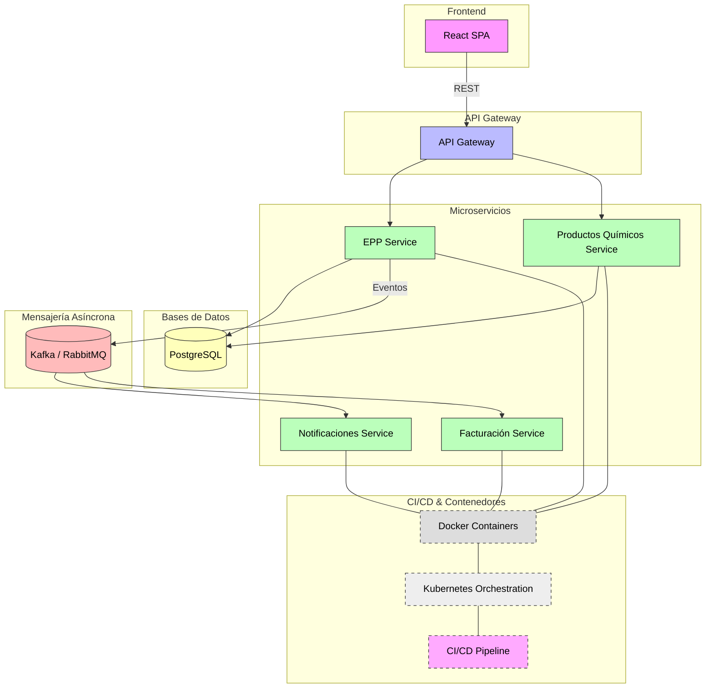
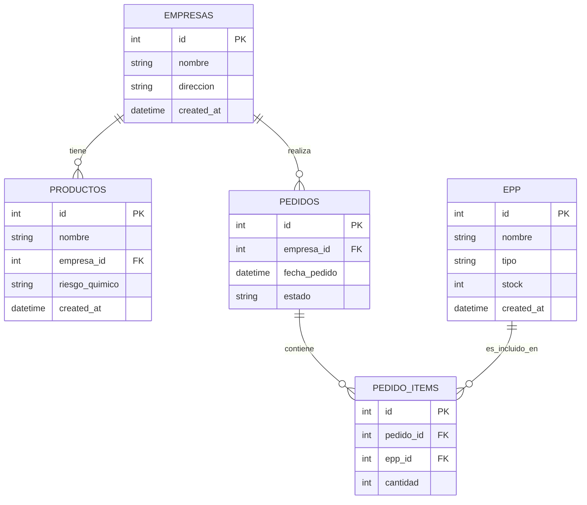

1. Arquitectura propuesta
Arquitectura general

Arquitectura propuesta – Microservicios

Justificación:

Arquitectura basada en microservicios para escalar cada módulo independientemente.

API Gateway centraliza el acceso y la autenticación.

Comunicación síncrona vía REST eventos para notificaciones y facturación.

Facilita integración futura con IA, analítica avanzada y nuevos módulos.

2. Stack tecnológico y justificación

- Spring Boot	Framework robusto, escalable, soporta microservicios, integración fácil con PostgreSQL y mensajería. Incluye validación, seguridad y testing nativos.
  
- React 18	SPA moderna, reutilización de componentes, integración con APIs REST o GraphQL.
  
- PostgreSQL	Mejor soporte para consultas analíticas complejas, funciones avanzadas (JSONB, CTEs, window functions), transacciones robustas y particionamiento.

MySQL vs PostgreSQL:

PostgreSQL ofrece ventajas analíticas y de escalabilidad que MySQL no tiene: índices avanzados, tipos de datos ricos, soporte nativo para JSON y agregaciones complejas.

Migración: herramientas como pgloader o ETL scripts para transformar esquemas y datos, validando tipos y procedimientos.

Librerías y servicios adicionales:

ORM: Spring Data JPA / Hibernate

Validación: Bean Validation (javax.validation)

Testing: JUnit, Mockito, Spring Boot Test

Seguridad: Spring Security JWT/OAuth2

Logging y monitorización: ELK Stack / Prometheus & Grafana

3. Estrategia de datos

Modelo de datos 

Relaciones:

Una empresa tiene muchos productos y muchos pedidos.

Cada pedido puede incluir múltiples EPP (relación muchos a muchos vía pedido_items).

El inventario de EPP se actualiza al aprobar pedidos.

Permite consultas analíticas por tipo de EPP, área de la empresa y periodo.

4. DevOps y despliegue
Flujo CI/CD

Desarrollo → Feature branch → Pull Request → Revisión → Merge

CI: compilación, tests unitarios, análisis de calidad con SonarQube

CD: despliegue a QA → staging → producción tras validación

Contenedores

Docker para cada microservicio

Kubernetes para orquestación, escalabilidad automática y tolerancia a fallos

Ventaja: portabilidad, despliegue reproducible y consistente

5. Casos de uso de IA
Predicción de consumo de EPP

Problema: anticipar necesidades de EPP por empresa y tipo de riesgo químico

Tipo de IA/ML: modelo de series temporales o regresión (Prophet, Random Forest)

Entrada: histórico de pedidos, tipo de EPP, volumen de productos químicos, área de la empresa

Salida: predicción de cantidad de EPP a solicitar por período

Valor de negocio: optimización de inventario, reducción de faltantes, planificación proactiva

6. Justificación de decisiones

Microservicios: escalabilidad modular y fácil integración con nuevas tecnologías. Riesgo: complejidad inicial y gestión de transacciones distribuidas.

Stack Spring Boot + React + PostgreSQL: robustez, soporte para microservicios y analítica avanzada. Riesgo: curva de aprendizaje y migración de código legacy.

Eventos asíncronos: desacoplan servicios críticos como notificaciones y facturación. Riesgo: monitoreo y manejo de errores más complejo.

Contenedores y Kubernetes: despliegue reproducible y escalable. Riesgo: requiere configuración inicial y experiencia en DevOps.

IA para predicción de EPP: reduce costos y mejora disponibilidad de inventario. Riesgo: requiere historial de datos consistente y actualización periódica del modelo.
